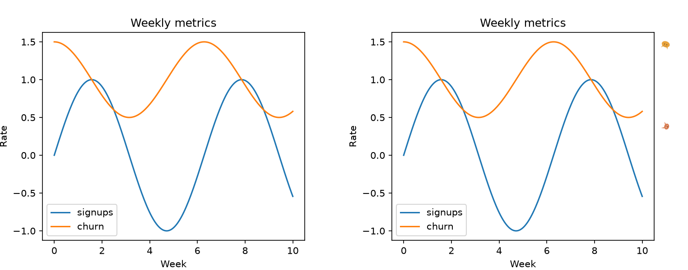

# meowplotlib



Whimsical cat decorations for `matplotlib` figures. One import, zero required config.

```python
import matplotlib.pyplot as plt
import meowplotlib  # cats now appear on every figure you show or save

plt.plot([1, 2, 3], [1, 4, 9])
plt.savefig("chart.png")
```

## Quickstart

```bash
pip install meowplotlib
```

```python
import meowplotlib

meowplotlib.set_style("chonk")      # or a list, or "mix"
meowplotlib.set_density("chaotic")  # "sparse" | "normal" | "chaotic"
meowplotlib.set_seed(42)            # reproducible layouts
meowplotlib.disable()               # turn it off for the rest of the session
meowplotlib.enable()                # turn it back on

with meowplotlib.config(enabled=False):
    ...  # one chart rendered without cats
```

## Config

| Function | Values | Effect |
|---|---|---|
| `set_style` | style name, list of names, or `"mix"` | which cat art pool(s) to draw from |
| `set_density` | `"sparse"` \| `"normal"` \| `"chaotic"` | how many cats appear |
| `set_seed` | `int` \| `None` | lock or randomize placement |
| `enable()` / `disable()` | — | session on/off switch |
| `config(**overrides)` | context manager | temporary overrides for one block |

## Art

v1 ships with three real cat art styles: `classic`, `derp`, and `chonk`. Adding or swapping a
style is a pure file-drop under `src/meowplotlib/assets/images/<style>/` plus one `styles.toml`
entry — no code changes required. See [ATTRIBUTION.md](ATTRIBUTION.md) for notes.

See `STANDUP_PLAN.md` and `constitution.md` for the full project contract.
